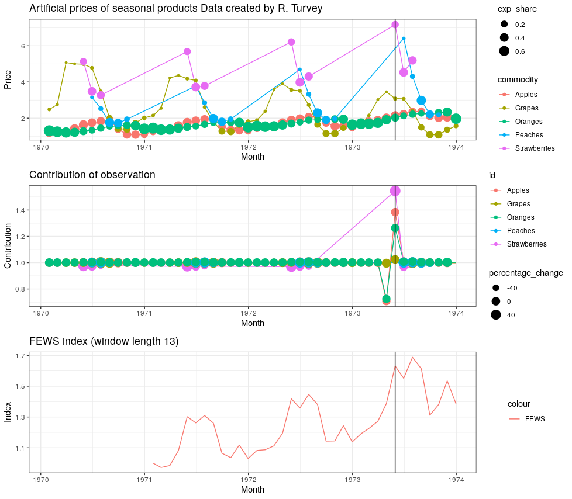

  Time Product Dummy (TPD) Decomposition
====

This package focuses on one function `TPDdecomp`, which decomposes the multilateral TPD index into the contributions of individual commodities. The calculation is based purely on the *Decomposing Multilateral Price Indexes into the Contributions of Individual Commodities* paper written by *Michael Webster* and *Rory C. Tarnow-Mordi*. It uses the techinque 
described under section [2.1.1. Simple TPD Decompositions](https://www.researchgate.net/publication/333875150_Decomposing_Multilateral_Price_Indexes_into_the_Contributions_of_Individual_Commodities).

This package should be coupled with the [FEWS package](https://github.com/MjStansfi/FEWS_package) originally optimized by Donal Lynch. This FEWS package aims to provide a flexible implementation of that (FEWS) method, with some additional splicing options available for users. As well as producing an index, the package provides users with some diagnostic results on the FEWS calculation which may be of use in data exploration, or in monitoring of production systems. In addition the package provides some utilities commonly used by Pricing teams from Statistical Agencies such as converting between indexes and movements.

Installation
============

  TPD decomposition function can be installed from GitHub using the following code

``` r

devtools::install_github("MjStansfi/TPDdecomp")

# Once installed, the package can be loaded as usual
library(TPDdecomp)
```

Usage
=====

The primary function provided by the the package is the `TPD_decomp()` function. Running `?TPD_decomp()` will give all the required information on how to use the function. An example of running the `TPD_decomp()` the function is shown below.


Example
-------

This pacakge includes the Turvey dataset as found in the [Consumer Price Index Manual](https://www.ilo.org/wcmsp5/groups/public/---dgreports/---stat/documents/presentation/wcms_331153.pdf).


The decomposition of the Turvey dataset with the contributions between 1973-04-30 and 1973-05-31 can be seen below.

``` r
#Make sure you restart your session if just installed

library(TPDdecomp)
library(dplyr)

contributions <- with(
    turvey,
    TPD_decomp(times = month,
               logprice = log(price),
               id = commodity,
               weight = price*quantity,
               custom_time = c("1973-04-30","1973-05-31"),
               window_length = NULL)
 )

#Comparing change from 1973-04-30 to 1973-05-31 

contributions%>%
  select(id,id_total_contrib)%>%
  arrange(id)%>%
  unique()
  
# id            id_total_contrib
# Apples        1.0393057
# Grapes        1.0170914
# Oranges       0.9969408
# Peaches       1.0043566
# Strawberries  1.1183779
```
Below compares the raw data to the contribution for the change between 1973 April to May where the verticle line represents May.


